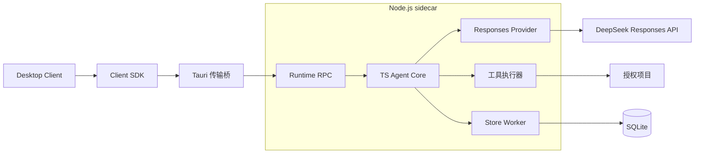

# 技术设计

适用版本：v0.1 · 更新日期：2026-09-14

## 1. 架构



Core 在 Runtime 进程中执行。Client 通过协议连接 Runtime，不在 WebView 中创建 Agent 循环。

| 部分 | 职责 | 状态归属 |
| --- | --- | --- |
| Agent Core | 循环、取消、工具调度、上下文及状态转换 | 当前执行的内存状态 |
| Runtime | 装配 Core、Provider、文件工具、存储、RPC 和恢复 | 任务、授权、事件及操作记录的唯一权威 |
| Client SDK | 类型化命令、订阅、重连和错误映射 | 连接状态及待确认请求 |
| Desktop Client | 项目树、对话、差异、确认与设置 | 可重建的界面投影 |
| Tauri Host | 窗口、系统选择器、凭据保护、sidecar 生命周期 | 进程句柄和系统资源 |

Rust 不实现模型循环、文件工具、数据库事务或业务状态机。Runtime 不调用桌面的 SQL、HTTP、文件插件。

### 核心接口

Core 定义 ModelProvider、ToolExecutor、Journal、Cancellation 和 RuntimeServices 接口，由 Runtime 注入。它不引用 DOM、React、Tauri、Node API 或数据库驱动。

ModelProvider 返回规范文本、工具意图及不透明的 providerState；Core 保存该状态，但不解析 DeepSeek 字段。工具和存储接口均为异步接口，支持内存替身。当前不定义通用 Process 工具。

### 工程边界

```text
apps/desktop/
  src/                    React 界面、Client SDK 装配
  src-tauri/              窗口、凭据、sidecar 与受限通信
packages/
  agent-core/             状态、循环、上下文、工具规则与接口
  protocol/               RPC/事件 schema、协议版本、错误码
  client/                 SDK 与可替换 Transport
  runtime/
    server/               RPC、任务服务、装配与生命周期
    providers/            DeepSeekResponsesProvider、FakeProvider
    adapters/             Node HTTP、文件、时间与取消
    tools/                文件执行器、路径策略、ChangeWriter
    storage/              Store Worker、SQLite 与迁移
tests/                    fixtures、integration、desktop、evals
```

依赖方向：Desktop → Client SDK → Protocol；Runtime → Core + Protocol。Core 不依赖 Client 或 Protocol；Runtime 将 Core 事件映射为对外事件。使用 npm workspaces 管理，所有包随同一应用版本发布，不单独发布 SDK。

## 2. Runtime 生命周期与传输

Tauri Host 从固定应用资源路径启动随包 Node 和 Runtime 入口，清除 NODE_OPTIONS、NODE_PATH 等注入项；不加载项目中的可执行配置，不使用模型提供的程序或启动参数。[sidecar 分发](https://v2.tauri.app/develop/sidecar/)

启动顺序：单实例检查 → 启动 Runtime → 协议握手 → 迁移及中断核对 → ready → Client 加载快照。Runtime 可由测试宿主独立启动，无须 WebView。

### 生命周期

| 情况 | 行为 |
| --- | --- |
| Client 刷新或重新挂载 | 重新订阅同一 Runtime，Run 不重新创建 |
| Client 暂时断开 | Runtime 保留状态；已确认的固定批次可继续，新修改等待确认 |
| Runtime 崩溃 | Host 最多重启一次；旧 Run 标为 interrupted，不自动重跑 |
| 用户退出应用 | 停止派发，等待在途写入和存储完成，再关闭 Runtime |
| Host 崩溃或管道关闭 | Runtime 停止接收任务并退出；Windows Job Object 清理残留进程 |

副作用尚未明确时不得启动下一 Run。强制结束可能留下 unknown 操作，下一次启动按第 5 节核对。首版不作为脱离桌面的常驻服务运行。

### 传输

Client SDK 的 Transport 在桌面侧使用 Tauri invoke / Channel，Host 与 Runtime 使用私有 stdin/stdout；stdout 仅传 UTF-8 JSON Lines，stderr 仅输出脱敏日志。不启动本地监听端口。

协议帧包含 protocolVersion、kind、id、method 和 payload；响应复用 id。握手返回 runtimeId、协议版本和能力；协议不兼容时拒绝启动。Runtime 重启生成新 runtimeId，使旧请求和临时流失效。

读端处理 UTF-8 字节分片、多帧与残帧。单帧上限 8 MiB；队列有界并支持背压。持久事件可从数据库重放，临时文本增量允许丢弃，不允许丢失后静默继续展示错误状态。

### 命令

| 方法 | 参数要点 | 结果 |
| --- | --- | --- |
| `task.create` | requestId、projectId、text | taskId |
| `task.submit` | requestId、taskId、expectedRevision、text | 新 runId |
| `task.steer` | taskId、runId、requestId、text | 待领取输入 |
| `run.cancel` | taskId、runId、requestId | 接受停止；终态由事件返回 |
| `approval.resolve` | approvalId、planHash、decision、expectedRevision | 一次性固定确认 |
| `task.snapshot/subscribe` | taskId、afterSeq | 一致快照或事件 |
| `project.list/read/search` | projectId、相对路径/条件、分页 | 有范围限制的界面查询 |
| `changes.revert` | changeSetId、expectedRevision | 撤销预览，确认后执行 |

业务变更按 requestId 持久去重，expectedRevision 拒绝过期操作。RPC id 用于关联一次传输，不能代替持久 requestId。

目录选择和密钥保存是 Host 本地命令。Host 将系统选择器结果和凭据通过独立控制消息交给 Runtime；通用 Client RPC 白名单不得转发这些控制消息。Runtime 再校验项目真实路径，模型不能登记新根目录或读取密钥。

## 3. 状态与事件

| 对象 | 定义 |
| --- | --- |
| Task / Run | 持久任务 / 一次启动或继续执行 |
| Step / Attempt | 一次模型响应及工具批次 / 一次网络尝试 |
| ModelTurn | 规范结果、Provider 原始输出项、配置与协议版本 |
| ToolCall | 内部 ID、模型 call_id、参数、顺序及结果 |
| FileVersion | 项目、相对路径、字节哈希、编码与读取范围 |
| ChangeSet | 固定修改批次、确认、前后版本及逐项结果 |

全局只运行一个 Run，工具串行。继续已结束任务创建新 Run。状态包括 queued、running、awaiting_approval、cancelling，以及 completed、failed、cancelled、interrupted 四种终态；completed 的 outcome 区分 success 与 partial。

单步流程：冻结上下文 → 请求模型 → 完整校验并提交 ModelTurn 和工具意图 → 预检及确认 → 串行执行工具 → 提交完整结果组 → 请求下一步。Responses 的 response.completed 只代表本次模型响应结束，仍有工具时不能将 Run 标为完成。

半截输出不执行；拒绝、参数错误和取消均形成结构化工具结果。补充输入在工具批次结束后生效。连续三次相同调用及错误结束自动循环。需要用户解释时结束本轮，收到回答再创建 Run。

事件包含 eventId、taskId、runId、seq、type、timestamp 和 payload。状态、事件及请求去重结果在同一 SQLite 事务提交后发送。seq 在任务内递增；Provider 的 sequence_number 只标识一次模型流，两者不得混用。

Client 先订阅缓冲，再读取带 lastSeq 的快照，只应用更大的 seq；缺号或 runtimeId 改变时重新同步。快照读取也通过 Store Worker，保证状态与 lastSeq 一致。

临时文本每 30–50 ms 合并发送，携带 runId、attemptId 和 streamRevision。重试重置预览；正文 delta 不逐 token 落盘，完整输出及最终 usage 随 ModelTurn 保存。

## 4. 文件工具

仅注册五个 function 工具，工具 schema 和 effect 由 Runtime 固定注册：

| 工具 | 输入 | 行为 |
| --- | --- | --- |
| `list_files` | projectId、相对目录、游标 | 分页列举源代码及配置文件 |
| `read_file` | projectId、相对路径、行区间 | 文本、行号、fileVersionId、SHA-256 |
| `search_text` | projectId、字面量、路径范围、游标 | 命中位置与上下文，不接受任意正则 |
| `write_file` | projectId、相对路径、content | 仅新建；父目录须存在，重名即冲突 |
| `edit_file` | fileVersionId、edits | 基于已读版本进行唯一匹配的文本替换 |

edits 为 oldText/newText 列表，针对同一基础版本校验唯一匹配且不重叠，新增内容沿用原换行风格。同一待确认批次不得重复修改同一路径；后续修改须重读。

所有操作通过 Runtime ResourceAccess / ChangeWriter，不接收 Client 指定的实现代码。Core 的参数校验和确认不能替代执行器的路径及版本复核。

工具结果包含 status、summary，可附 data、fileVersionIds、changeSetId、truncated、nextCursor、error。status 为 ok / error / denied / cancelled / unknown；Provider 按原 call_id 回传结果。

| 限制 | 初始值 |
| --- | --- |
| 单 Run | 30 Step、100 次工具调用、20 分钟活动时间 |
| 单文件 | 1 MiB |
| 枚举 | 单页 500 项，任务扫描最多 10,000 项 |
| 读取或搜索结果 | 32 KiB，超限分页 |
| 修改批次 | 10 个文件、2 MiB 新内容 |

等待用户不计入活动时间。仅支持 UTF-8，保留已有 BOM 和 LF/CRLF；拒绝其他编码、二进制及混合换行。新文件默认 UTF-8 无 BOM、LF。

遵循 .gitignore，默认排除 .git、依赖、生成目录、凭据和私钥；使用源文件/配置文件白名单及内容检查。不执行 Git、项目配置、脚本或其他命令。

## 5. 修改、取消与恢复

### 固定修改批次

1. 登记读取版本，生成最终字节、差异、beforeHash、afterHash 和 planHash。
2. 展示整个批次，确认只适用于该哈希、工具版本及项目范围；变化后重新预览。
3. 执行前复核真实路径和当前哈希，持久保存 prepared 记录；存储失败则不写文件。
4. ChangeWriter 保存并同步旧字节备份。新建采用排他创建；修改采用同目录暂存和替换，不以删除目标作为失败后的重试方式。
5. 重读目标，核对哈希后保存实际结果和工具结果，再继续执行。

路径策略覆盖大小写、越界、设备名、尾部空格/点及 ADS；拒绝 UNC、设备路径、符号链接和 junction。新建检查父目录。Node Runtime 以当前用户权限运行，此策略不是 OS 沙箱，也不能隔离恶意本机进程的路径竞态。

哈希检查可发现提交前的版本变化，不提供与外部编辑器之间的原子 compare-and-swap。多文件逐项提交，无整批原子性保证。

撤销也展示固定预览，只有当前哈希等于原 afterHash 才还原备份。撤销新建仅可移除仍匹配记录的该文件，不提供通用删除工具。

### 取消

Core 使用 Cancellation，Runtime 将其映射为 HTTP AbortSignal 和工具取消检查。取消先阻止新请求与新工具；已经进入文件提交阶段的操作须等结果明确后停止，不把“收到取消”视作撤回写入。

Client 在 200 ms 内显示正在停止。实际停止后为 cancelled；进程被终止或副作用不明为 interrupted。等待确认时释放事务和文件锁。已完成修改保留，不自动撤销。

### 恢复规则

| 中断位置或当前状态 | 处理 |
| --- | --- |
| 模型流未完整提交 | Attempt 中断，其工具不执行 |
| 工具意图已提交、未开始 | 用户继续后重验范围、版本和确认 |
| 写操作开始、无最终记录 | 标为 unknown，核对目标、暂存和备份 |
| 目标等于 afterHash | 补记当前已达到预期状态，不重复写 |
| 目标等于 beforeHash | 保留当前原状态，重新预览确认后才可重试 |
| 目标不匹配前后版本 | 保留 unknown，等待人工核对 |
| 工具结果已提交、模型未继续 | 复用结果，仅恢复模型请求 |

unknown 阻止新的自动修改。哈希证明当前内容，不能证明写入者。Runtime 恢复持久历史后，Provider 重建完整 Responses input，不依赖服务端 response ID 续接。

## 6. 存储、凭据与诊断

数据位于 `%LOCALAPPDATA%\Tilot`，开发使用 Tilot-Dev；数据库为 data/tilot.sqlite，操作备份为 `tasks/<taskId>/operations`。Client 不直接访问这些数据。

Store Worker 使用 better-sqlite3，独占数据库写连接；启用外键、WAL、busy timeout 和 synchronous=FULL。事务在 Worker 内完整执行，失败整体回滚，不跨网络、文件 I/O 或用户等待。[SQLite WAL](https://www.sqlite.org/wal.html)

| 表 | 内容 |
| --- | --- |
| projects / tasks / runs | 根目录、revision、last_seq、运行状态和配置 |
| model_turns / response_items | 规范投影、原始输出项、原顺序及 Provider schema |
| attempts / tool_calls | 网络尝试、usage、原 call_id、参数与结果 |
| change_sets / operations / approvals | 固定计划、备份、前后哈希及确认 |
| file_versions / events / commands / inbox | 读取版本、持久事件、请求去重及补充输入 |
| compactions / schema_migrations | 摘要边界与数据版本 |

数据库和项目文件不共享事务，通过操作记录恢复。升级先作一致备份，再按版本迁移；失败停止写入，高版本 schema 拒绝降级。任务删除只清理私有历史和备份，不触碰项目源文件。

Host 使用当前用户范围 DPAPI 保存 Key，解密后仅经私有控制通道交给 Runtime 内存。Key 保存后不回传 WebView；设置查询仅返回配置状态。独立测试宿主通过同一凭据接口注入测试凭据，Runtime 不依赖桌面解密 API。[DPAPI](https://learn.microsoft.com/en-us/windows/win32/api/dpapi/nf-dpapi-cryptprotectdata)

Key 不进入命令行、环境变量、日志、事件或模型输入。保护失败时仅会话内使用；DPAPI 不隔离同用户恶意进程。历史和备份默认本地明文，被模型读取的代码会发往 DeepSeek。

## 7. 桌面边界

WebView 只暴露必要的 Host command，用于 RPC、Channel 订阅、目录选择和密钥保存。普通 `#[tauri::command]` 经 `invoke_handler` 注册后，默认可被应用内所有 window/webview 调用；仅配置 capability 不会自动将这些命令变成白名单。[Capabilities](https://v2.tauri.app/security/capabilities/)

v0.1 在 `build.rs` 中通过 `AppManifest::commands` 为全部 Host command 生成权限，再由 capability 仅向受信任的主 WebView 授予所需权限。封装内部 plugin 并定义 permissions 也是可选方式，首版采用应用命令方案。[AppManifest](https://docs.rs/tauri-build/latest/tauri_build/struct.AppManifest.html#method.commands)

敏感 command 在 Rust 内再次校验调用来源和参数：使用 Tauri 提供的调用 WebView 信息核对身份与页面来源，不信任前端自报身份；限制 RPC 方法和帧大小，Channel 绑定已校验的调用方。Runtime 继续校验任务归属、根目录及执行状态。ACL 约束命令调用权限，业务校验由 Host/Runtime 负责。

不向 WebView 提供通用 shell、数据库、文件或 HTTP 能力；不授予远程页面调用权限。

Client 仅加载随包页面，设置 CSP，限制导航和新窗口。代码、差异和 Markdown 按数据渲染，不执行脚本或加载远程资源。模型不具备注册工具、调用 RPC 或扩展授权的能力。

日志记录关联 ID、耗时、错误分类与 usage，默认不记录代码全文或请求头。缺失 usage 标为未知。应用只确认文件读写结果，不声明编译、运行或测试通过。
