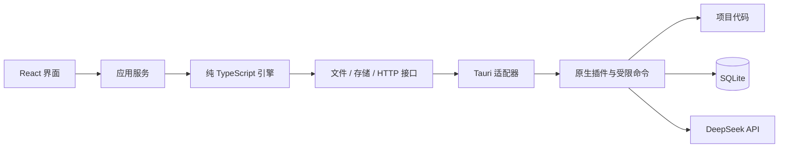

# 技术设计

适用版本：v0.1 · 更新日期：2026-09-14

## 1. 架构与职责



首版的界面、应用服务和引擎位于同一 WebView；图中为模块边界，不代表独立进程。

| 模块 | 职责 |
| --- | --- |
| UI | 项目树、对话、状态、代码和差异预览 |
| AppService | 持有唯一引擎实例、用户命令、事件投影及生命周期 |
| task-engine | 模型循环、工具规则、修改计划、上下文与恢复决策 |
| adapters/tauri | 把核心接口转换为 Tauri 插件调用或原生命令 |
| Native | 窗口、可信项目登记、文件提交、事务、凭据及能力限制 |

引擎不依赖 DOM、React、Tauri、node:fs 或 Node 全局对象。运行平台由入口注入，不在核心中判断浏览器或 Node 环境。

### 核心接口

| 接口 | 能力 |
| --- | --- |
| FileSystem | 项目内分页枚举、版本读取、提交已预检内容、核对操作 |
| Storage | 读取历史、按预期版本原子提交状态和事件 |
| HttpTransport | 返回状态、响应头及异步字节流，支持取消 |
| Credentials | 会话内取得 Provider 凭据 |
| RuntimeServices | 时间、ID、UTF-8 解码、让出执行权与取消订阅 |

接口使用普通数据、Uint8Array、Promise 和 AsyncIterable；HTTP 的 Request/Response、DOM 事件与 AbortController 留在适配器。核心使用自有 Cancellation 接口，不要求 DOM 类型库。当前没有 Process 接口或命令执行工具。

### 目录

```text
src/
  ui/                 React 界面
  app/                引擎实例、应用服务、装配
  task-engine/
    core/             状态、循环、取消与输入队列
    providers/        DeepSeekProvider、FakeProvider
    tools/            五个代码文件工具
    policy/           修改计划与执行规则
    context/          消息投影、预算、压缩
    ports/            平台无关接口
  adapters/tauri/      文件、SQL、HTTP、凭据和调度
  shared/             数据 schema、ID 与错误码
src-tauri/
  src/                窗口、文件、事务、凭据命令
  capabilities/       主窗口及插件权限
  migrations/         版本化 SQL
tests/                核心、原生集成、桌面、契约与评测
```

不分发 Node runtime、sidecar 或 Node 原生模块。Node 仅用于开发构建和测试。

## 2. 生命周期与调用边界

AppService 在应用入口创建一次，不随 React 组件挂载重复创建。启动顺序为原生初始化 → 数据库迁移 → 核对旧执行 → 加载历史 → 开放新任务。

任务循环采用异步 I/O；搜索、差异计算和消息处理分块执行，通过 RuntimeServices 定期让出线程，避免长同步循环阻塞取消按钮。首版不引入 Web Worker，后续仅在测量证明必要时增加。

正常关闭先取消模型和新工具，等待已开始的原生写入及数据库提交，再退出。页面重载或 WebView 崩溃会中断引擎，不能保证关闭后继续运行；窗口最小化与系统睡眠的行为单独验收。

Host 为每次 WebView 初始化分配 sessionId；新会话拒绝旧会话尚未开始的写请求，先等待原生在途操作结束，再执行恢复核对。丢失返回值的文件操作按 unknown 处理，不因页面重载直接重试。

### 应用服务

以下为 TypeScript 应用服务，不是全部暴露为原生 IPC 的方法。

| 方法 | 主要参数 | 行为 |
| --- | --- | --- |
| `project.select` | 系统目录选择 | 原生侧登记可信 projectId |
| `task.create/submit` | requestId、projectId/taskId、expectedRevision、text | 创建任务或新 Run |
| `task.steer` | taskId、runId、requestId、text | 在批次结束后领取补充输入 |
| `run.cancel` | taskId、runId、requestId | 接受停止，最终状态异步更新 |
| `approval.resolve` | approvalId、planHash、decision、expectedRevision | 确认固定修改批次 |
| `task.snapshot/subscribe` | taskId、afterSeq | 数据快照和进程内事件订阅 |
| `changes.revert` | changeSetId、expectedRevision | 撤销预览与确认 |
| `settings.saveKey` | providerId、key | 保存后只返回配置状态 |

变更命令按 requestId 去重，expectedRevision 拒绝过期操作。UI 只调用应用服务，核心只调用注入接口；使用静态导入规则保持边界。

原生 IPC 限于 project_select、file_list/read/apply/inspect、store_commit、session_open/drain 和 credentials 等必要命令。检查来源主窗口、sessionId、参数及资源范围；不提供任意程序执行、任意数据库路径或模型指定 SQL 的接口。

## 3. 任务、事件与循环

| 对象 | 定义 |
| --- | --- |
| Task | 一个项目中的持久任务与对话历史 |
| Run | 一次启动或继续执行 |
| Step / Attempt | 一步模型请求及工具批次 / 一次网络尝试 |
| ToolCall | 模型原调用 ID、参数、顺序及最终结果 |
| FileVersion | 项目、相对路径、原始字节哈希、编码与读取范围 |
| ChangeSet | 固定修改批次、前后版本、确认及逐项结果 |

v0.1 全局只运行一个 Run，工具串行。同一任务的继续操作创建新 Run。状态为 queued、running、awaiting_approval、cancelling，以及 completed、failed、cancelled、interrupted 四种终态；completed 的 outcome 区分 success 与 partial。

单步流程：

1. 保存输入，冻结本步上下文与模型配置。
2. 检查取消、预算和未判定操作，发起模型请求。
3. 完整聚合响应，提交 assistant 消息与工具意图。
4. 校验工具参数；读操作直接执行，写操作生成固定预览并等待确认。
5. 串行执行，按模型声明顺序补齐全部工具结果。
6. 提交结果后进入下一步；模型结束时核对实际修改与失败项。

半截流式调用不执行。被拒绝、未执行或取消的完整调用均有结构化结果。补充需求在工具批次结束后生效；连续三次相同调用及错误结束自动循环。需要用户解释时，模型提出问题并结束本轮，收到回答后创建新 Run。

持久事件包含 schemaVersion、eventId、taskId、runId、seq、type、timestamp、payload。状态、事件及命令去重结果在同一事务提交后发送。seq 在任务内递增，时间使用 UTC ISO-8601。

文本增量按 30–50 ms 合并，不逐 token 落盘；携带 runId、attemptId、streamRevision。UI 先订阅缓冲，再读取快照，只应用大于 lastSeq 的事件；缺号时重新同步。重试重置当前预览，不拼接旧 Attempt。

## 4. 工具契约

仅注册以下五个模型工具：

| 工具 | 输入 | 结果与约束 |
| --- | --- | --- |
| `list_files` | projectId、相对目录、游标 | 按忽略规则分页枚举代码与配置文件 |
| `read_file` | projectId、相对路径、行区间 | 文本、行号、fileVersionId、原始字节 SHA-256 |
| `search_text` | projectId、字面量、路径范围、游标 | 文件、行号和上下文；不接受任意正则 |
| `write_file` | projectId、相对路径、content | 仅新建；父目录须存在，目标存在即冲突 |
| `edit_file` | fileVersionId、edits | 已读取版本的精确文本替换，生成差异后确认 |

edits 为 oldText/newText 列表，针对同一原始版本预检；每项必须唯一匹配且互不重叠，新增文本沿用原文件换行风格。不同调用不得在同一待确认批次内修改同一路径；后续修改需重新读取版本。所有写入复用同一个 ChangeWriter。

工具结果包含 callId、status、summary，可附 data、fileVersionIds、changeSetId、truncated、nextCursor、error。status 为 ok / error / denied / cancelled / unknown。工具 effect 由应用注册，不采用模型声明。

### 默认限制

| 项目 | 初始上限 |
| --- | --- |
| 单 Run | 30 Step、100 次工具调用、20 分钟活动时间 |
| 单文件 | 1 MiB，超限拒绝编辑 |
| 文件枚举 | 单页 500 项，单次任务扫描 10,000 项 |
| 读取或搜索结果 | 32 KiB，截断时返回下一位置 |
| 修改批次 | 10 个文件、2 MiB 新内容 |

等待用户不计入活动时间。编码限 UTF-8，接受并保留已有 BOM、LF/CRLF；其他编码、二进制及混合换行文件返回明确限制，不自动转换。新文件默认 UTF-8 无 BOM、LF。

文件范围限源代码及相关文本配置。使用扩展名/文件名白名单与内容检查，遵循 .gitignore，并默认排除 .git、node_modules、target、dist、凭据及私钥。扫描直接解析忽略规则，不调用 Git，不执行项目配置。

## 5. 修改、取消与恢复

### 修改批次

1. 读取并登记基础版本；校验路径、编码、大小和工具参数。
2. 生成最终字节、差异与 ChangeSet，记录操作 ID、beforeHash、afterHash、工具版本及 planHash。
3. 一次展示完整批次。确认仅适用于该 planHash；内容、版本或范围变化需重新预览。
4. 执行前复核路径与哈希，先提交包含前后版本及备份位置的 prepared 记录；存储失败时不修改项目文件。
5. 调用原生 file_apply，重新检查项目范围与哈希，备份落盘成功后才提交目标文件。新建采用排他创建；修改采用同目录暂存及替换，不以删除目标文件作为失败后的重试方式。
6. 重新读取校验结果，提交逐项状态、实际哈希和工具结果。

路径检查覆盖大小写、分隔符、越界、保留名称、尾部点/空格和 ADS；拒绝 UNC、设备路径、符号链接及 junction，创建前检查父目录。权限限于用户选择的本地项目。

每次写入前的版本检查用于发现外部编辑冲突，不提供与其他进程之间的原子 compare-and-swap 保证。修改期间不应由多个工具同时写同一文件；检查与写入间的竞态属于已知限制，见 M3 验证。

多文件逐项提交，不保证整批原子性。撤销也生成固定预览；仅当当前字节匹配原 afterHash 时还原备份。撤销新建文件仅可移除仍匹配记录的该文件，不能扩展为通用删除操作。

### 取消

Cancellation 接口贯穿 Provider、搜索及工具调度；HTTP 适配器将其转换为 AbortSignal。取消立即阻止新请求和新工具；已进入文件提交阶段的操作等待完成并记录真实结果，不能把取消请求当作已撤回写入。

UI 在 200 ms 内显示“正在停止”。只有在途操作结果明确后才进入 cancelled；进程被终止或结果不明进入 interrupted。停止不自动撤销已完成修改。

### 恢复

| 中断位置 | 处理 |
| --- | --- |
| assistant 未完整提交 | Attempt 中断，不执行其工具 |
| prepared 已保存、尚未开始 | 用户继续后重新校验，旧确认失效 |
| 写操作开始、无最终记录 | 标记 unknown，核对目标、暂存与备份 |
| 文件等于 afterHash | 记录目标已达到预期状态，补齐结果；不重复写入 |
| 文件等于 beforeHash | 记录当前仍为原状态，重新预览后才可重试 |
| 文件不匹配前后版本 | 保留 unknown，提示人工核对 |
| 结果已提交、模型未继续 | 复用工具结果，仅恢复模型请求 |

unknown 阻止后续自动修改。文件哈希可确认当前内容，不能证明是哪一个进程完成写入；恢复记录不夸大执行事实。

## 6. 存储与事务

采用 Tauri SQL 插件的 SQLite 驱动。数据库连接和 migration 由原生插件管理；TypeScript StorageAdapter 管理查询、状态映射及提交请求。

逻辑数据库为 `sqlite:tilot.sqlite`，实际位置以插件的 app_config_dir 为准；代码备份使用 app_local_data_dir 下的 operations 目录。开发与正式版本采用不同应用标识。设置页可查看实际路径，避免硬编码盘符。[SQL 插件](https://v2.tauri.app/plugin/sql/)

### 事务边界

当前插件 JavaScript 接口未暴露事务对象，后端单次查询从连接池执行。不能用多个 execute 调用拼接 BEGIN / COMMIT，也不能把 migration 的事务能力当作任务事务。[JS 接口](https://github.com/tauri-apps/plugins-workspace/blob/v2/plugins/sql/guest-js/index.ts) · [连接池实现](https://github.com/tauri-apps/plugins-workspace/blob/v2/plugins/sql/src/wrapper.rs)

增加一个原生 store_commit 命令：从插件管理的 SQLite 池取得单个连接，在同一事务中校验 revision、写入状态/事件/请求去重记录，再提交；任一步失败则回滚。复用插件公开的 DbInstances/DbPool，不创建第二套数据库。[插件实现](https://github.com/tauri-apps/plugins-workspace/blob/v2/plugins/sql/src/lib.rs)

提交参数为版本化记录集合，Rust 使用固定 SQL 模板和参数绑定，不接收模型生成 SQL。所有业务写入经过此命令，原生侧串行化提交；插件用于初始化和固定查询。事务不跨用户等待、HTTP 请求或文件 I/O。

M0 检查实际连接的 foreign_keys、synchronous、journal_mode 和 busy_timeout；所需设置作用于真实写连接，不假设一次 PRAGMA 会配置整个连接池。

| 表 | 内容 |
| --- | --- |
| projects / tasks / runs | 根目录登记、revision、last_seq、状态和配置快照 |
| messages / attempts | 规范模型历史、网络尝试、usage 与错误 |
| tool_calls / change_sets / operations | 参数、批次、前后版本、备份和逐项结果 |
| approvals / file_versions | 固定确认、读取版本及定位 |
| events / commands / inbox | 持久事件、请求去重及补充输入 |
| compactions | 压缩边界与摘要 |

失败 Attempt 的临时预览不进入规范历史。迁移版本由插件管理，避免另建不一致的迁移账本。数据库与项目文件仍不是同一事务，按第 5 节操作记录恢复。

升级前停止执行并制作数据库一致备份，同时包含本地操作备份目录；不能直接复制仍在写入的数据库主文件。迁移失败停止启动，较高 schema 拒绝降级写入。删除任务仅清理私有历史与备份，不删除项目代码。

## 7. 权限、密钥与诊断

原生命令复核项目范围；Tauri capabilities 仅授予主窗口必要命令、SQL 和 HTTP 插件能力。应用命令须在构建清单中显式登记权限。核心接口和导入规则是模块边界，不是同一 WebView 内的安全隔离。[Capabilities](https://v2.tauri.app/security/capabilities/)

HTTP 权限仅允许 DeepSeek 所需接口；关闭重定向，不关闭 TLS 验证。首版连接地址固定于应用支持的配置，模型不能更改。新增地址需同时修改适配器和原生能力配置。

Host 使用当前用户范围的 DPAPI 保存 API Key。HTTP 适配器发起请求时，Key 会短暂进入 WebView 内存，再交给原生 HTTP 插件；不宣称密钥始终停留在 Rust。Key 不进入 React 状态、数据库、持久事件、日志或模型消息，用后释放引用；JavaScript 无法保证内存立即清零。[DPAPI](https://learn.microsoft.com/en-us/windows/win32/api/dpapi/nf-dpapi-cryptprotectdata)

WebView 仅加载随包页面，限制导航与新窗口，使用严格 CSP。代码、差异和 Markdown 按数据渲染，不执行 HTML、脚本或远程资源。模型只获得五个注册工具，不获得原生 IPC、数据库或网络接口。

任务历史与备份默认明文保存在本机，被模型读取的代码会发送至 DeepSeek。DPAPI 不隔离同用户恶意进程；首版不加载第三方可执行插件或不可信页面。

错误码至少包含 AUTH_INVALID、RATE_LIMITED、PROVIDER_PROTOCOL_ERROR、INPUT_INVALID、FILE_CHANGED、FILE_EXISTS、FILE_LOCKED、UNSUPPORTED_ENCODING、ACCESS_DENIED、EXECUTION_UNKNOWN、CANCELLED、STORAGE_ERROR。

日志保留关联 ID、耗时、错误类别和 usage，不记录全文代码或请求头。应用只能确认文件读写结果，不能声称已经编译、运行或通过测试。
