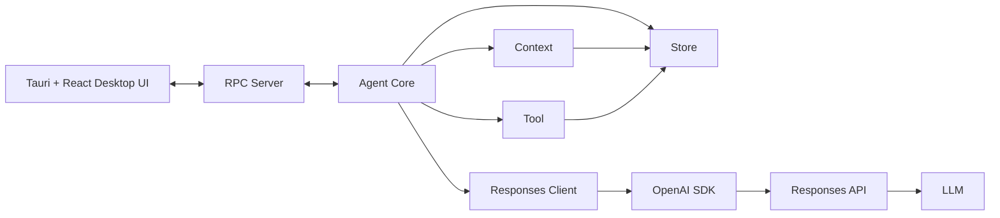

# Tilot 技术设计文档

**目标：桌面端本地 Agent，基于 Tauri + React + TypeScript + Node.js sidecar，仅接入 Responses API**

## 项目目标

Tilot 是一个本地桌面 Agent。桌面 UI 负责用户交互，Node.js Agent Runtime 负责 Agent 执行、上下文构造、工具调用、MCP、持久化以及模型请求。

整体设计遵循几个原则：

1. UI 不直接运行 Agent Loop。
2. UI 不直接调用模型 API。
3. Agent Core 是 Agent 执行流程的唯一调度中心。
4. Context 负责“模型这一轮看到什么”。
5. Tool 负责“模型可以做什么”，MCP 也属于 Tool。
6. Store 负责“应用长期保存什么”。
7. 仅支持 Responses API，不设计通用多协议 Provider 抽象。
8. UI 与 Runtime 通过 RPC 通信，并通过事件实现流式输出。

---

# 总体架构



系统主要分成六个核心模块：

```text
Server
Agent Core
Context
Tool
Store
Responses
```

其中 Agent Core 是整个 Agent Runtime 的调度中心。

---

# Server

Server 是 UI 与 Agent Runtime 之间的边界。

它负责 RPC 通信，但不负责 Agent 业务逻辑。

例如 UI 调用：

```ts
client.turn.start({
  threadId,
  input: "帮我分析这个项目",
});
```

经过 RPC 后，Server 最终调用：

```ts
agentCore.runTurn({
  threadId,
  input,
});
```


Server 主要负责三类事情。

### Request

例如：

```text
thread.create
thread.list
thread.read

turn.start
turn.steer
turn.interrupt

config.get
config.set

model.list

mcp.list
mcp.connect
```

### Response

RPC 请求对应的结果：

```json
{
  "id": "req_123",
  "success": true,
  "result": {}
}
```

### Event

Agent Runtime 主动推送给 UI：

```text
turn.started

message.started
message.delta
message.completed

tool.started
tool.updated
tool.completed

context.compacted

turn.completed

error
```

因此 UI 与 Runtime 的通信模型是：

```text
Request / Response
+
Server Push Event
```

---

# Agent Core

Agent Core 是 Tilot 的核心调度模块。

它负责：

```text
开始 Turn
调用 Context
调用 Responses API
处理模型输出
判断 Tool Call
执行 Tool
保存执行结果
再次调用模型
结束 Turn
处理取消
产生运行事件
```

Agent Core 不负责：

```text
SQL
MCP 协议细节
Skill 文件解析细节
Responses API SDK 细节
UI
RPC 序列化
```


Agent Core 知道的是：

> 什么时候需要 Context。

但它不应该知道：

> Context 内部具体应该加载哪些消息、Skill、摘要。

---

# Context

Context 负责解决一个核心问题：

> **下一次 Responses API 请求应该给模型什么内容？**

Store 保存的是完整数据，而 Context 从完整数据中选择、转换和组织模型真正需要看到的内容。

---

# Skill

Skill 规范参考OpenAI官方的相关文档


# Tool

Tool 管理所有“Agent 能做什么”的能力。

所有与工具有关的内容都归入：

```text
tool/
```

包括：

```text
Built-in Tool
MCP Tool
Tool Registry
Tool Executor
Permission
Tool Result
```

可以逐渐演进成：

```text
tool/
├── builtin/
│   ├── read-file/
│   ├── write-file/
│   ├── shell/
│   └── apply-patch/
│
├── mcp/
│   ├── client/
│   ├── connection/
│   └── config/
│
├── registry/
├── executor/
├── permission/
└── types/
```

不过这些都是 Tool 内部实现细节，对 Agent Core 只暴露统一接口。

# MCP

MCP 完全属于 Tool。

MCP 负责：

```text
连接 MCP Server
初始化 MCP Session
tools/list
tools/call
resources/list
resources/read
认证
超时
连接生命周期
```

但是 MCP Tool 最终必须转成 Tilot 的统一 Tool 定义。

例如：

```text
Tool Registry
├── read_file
├── shell
├── apply_patch
├── github.search
└── database.query
```

模型无需知道：

```text
read_file 是 Tilot 内置 Tool

github.search 是 MCP Tool
```

执行时再由 Tool 层路由：

```text
Agent Core
    ↓
Tool.execute()
    ↓
Tool Registry
   /        \
Builtin     MCP
  ↓          ↓
Executor   MCP Client
              ↓
          MCP Server
```

---

# Store

Store 是 Tilot 的统一持久化边界。

定义：

> **Store 负责所有进程退出后仍然需要存在的数据。**

例如：

```text
对话
Thread
Turn
Message
Tool Call
Tool Result
Compaction
配置
Workspace
API Key
OAuth Token
```

Store 不负责：

```text
Agent 调度
Context 构造
Tool 执行
模型请求
RPC
```

---

# Responses 模块

Tilot 明确只支持 Responses API，因此不设计：

```text
Provider
├── OpenAI
├── Anthropic
├── Gemini
└── ...
```

这种通用 Provider 系统。

所有类型，与Responses API 强耦合，能用的直接复用

使用流式输出

---

# Config

配置统一归入 Store。


# 模块依赖原则

建议长期保持以下依赖方向：

```text
UI
 ↓
Server
 ↓
Agent Core
 ├── Context
 │      ↓
 │     Store
 │
 ├── Tool
 │      ↓
 │     Store
 │
 ├── Store
 │
 └── Responses
        ↓
      OpenAI SDK
```
